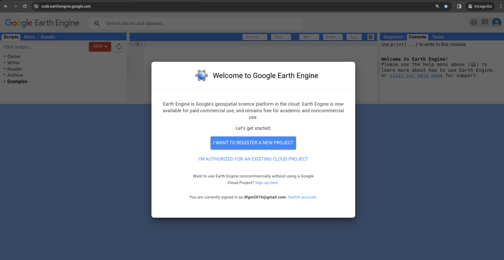

# Configuración de tu Cuenta de Google Earth Engine (GEE)

¡Bienvenido! Antes de comenzar a explorar el poder de Google Earth Engine, necesitarás configurar tu cuenta. Sigue estos pasos para registrarte y configurar tu entorno.

## 🔑 Registro en Google Earth Engine

**Importante:** Se requiere una cuenta de GEE para exportar correctamente imágenes y productos de datos como activos de GEE o aplicaciones SEPAL utilizando GEE desde la interfaz SEPAL. Necesitarás registrar una cuenta de Google en GEE.

Para registrarte, sigue este enlace: [https://code.earthengine.google.com](https://code.earthengine.google.com) y selecciona la opción **"Quiero registrar un nuevo proyecto"**.

## ☁️ Crear un Proyecto de Google Cloud (GCP)

**Atención:** Google Earth Engine ahora requiere conectarse a un proyecto de Google Cloud (GCP). Esta conexión está disponible tanto para uso comercial (de pago) como para fines académicos y de investigación (gratuito).

1.  **Selecciona "Registrar un proyecto No eslogan o comercial en la nube"** en la página de registro de GEE.
2.  **Sigue las instrucciones** para crear tu cuenta.

    * **Selecciona el uso no pagado** y elige tu tipo de proyecto (por ejemplo, Academia e Investigación, Gobierno, Sin fines de lucro). Luego, selecciona **Siguiente**.
    * **Crea o elige un proyecto de GCP existente** para registrar tu proyecto. Luego, selecciona un **Project-id** y, opcionalmente, un nombre de proyecto. Selecciona **Continuar al resumen**.

3.  **Acepta los Términos de Servicio de la Nube:**
    * Una **alerta roja** aparecerá en la parte inferior de la página, solicitando que aceptes los Términos de servicio de la nube para continuar. **Selecciona el enlace** proporcionado.
    * Serás redirigido a la página de Google Cloud. Lee y acepta los **Términos de servicio 1(1)** y, opcionalmente **2(2)**, marca la casilla para recibir actualizaciones por correo electrónico. Selecciona **Acuerdo y continuar 3(3)**.

4.  **Confirma tu Proyecto:**
    * Finalmente, revisa el resumen de tu proyecto y selecciona **Confirmar**.

¡Listo! Tu proyecto está registrado y puedes comenzar a usar GEE.

**💡 Tip:** Si experimentas problemas al vincular tu cuenta de Google con GEE, no dudes en preguntar al [Google Group de apoyo]([ENLACE AL GRUPO DE SOPORTE DE GEE]).

## 🏠 Iniciar la Carpeta de Inicio en GEE

Para utilizar tu cuenta de GEE en la interfaz SEPAL, es crucial configurar la **carpeta Inicio**. Aquí es donde se exportarán todos tus **Activos** (es decir, Vectores, Rasters, Colecciones, Mosaicos y Clasificaciones). No configurar esta carpeta impedirá la ejecución exitosa de las solicitudes de exportación.

Para configurar la carpeta Inicio, sigue estos pasos:

1.  **Ve al Editor del Código de Motores de la Tierra:** [https://code.earthengine.google.com/](https://code.earthengine.google.com/)

2.  **Explora la Interfaz:** La página del Editor se divide en tres zonas principales y un mapa:

    * **Zona 1: Información de tu Cuenta GEE**
        * **Activos:** Muestra todos los activos almacenados en tu cuenta.
        * **Scripts:** Contiene todos los scripts disponibles (compartidos y los que has escrito).
        * **Doc:** Accede a la documentación de la GEE JavaScript API (GEE JS API), útil si necesitas codificar directamente en este editor.

    * **Zona 2: Editor de Código (Avanzado)**
        * Permite a usuarios avanzados escribir sus propios scripts utilizando la API GEE JS.

    * **Zona 3: Información de Procesos**
        * **Inspector:** Al hacer clic en cualquier lugar del mapa, muestra información sobre los datos visualizados en esa ubicación.
        * **Tareas:** Muestra todas las tareas en tu cuenta y su estado actual (Ejecutando, Finalizado, Fallido).
        * **Consola:** Muestra la salida de la consola de los scripts en ejecución.

3.  **Crea la Carpeta Inicio:**
    * En la **Zona 1**, selecciona **Activos**.
    * Haz clic en **Crear carpeta casera**.

4.  **Nombrar la Carpeta Inicio:**
    * Selecciona el nombre para tu carpeta. **Importante:** Este nombre solo se puede configurar una vez y no se puede cambiar después. Si no estás satisfecho con el nombre sugerido, puedes crear uno propio, siempre y cuando no contenga espacios ni caracteres especiales.

5.  **Verifica la Creación:**
    * Cuando vuelvas a tu lista de **Activos** (en el panel de la Zona 1), deberías ver el nombre que proporcionaste como la primera carpeta en la raíz del árbol de Activos.

**📌 Nota:** Después de inicializar tu cuenta de GEE y configurar la carpeta Inicio, ¡estás listo para iniciar!
